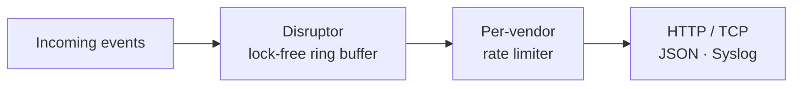
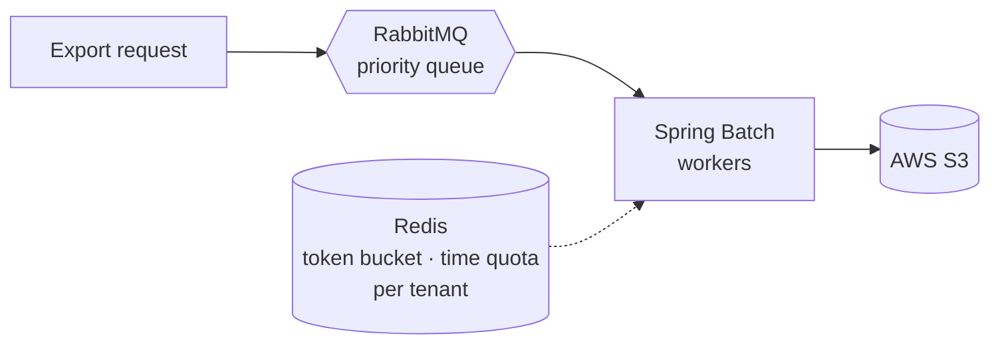
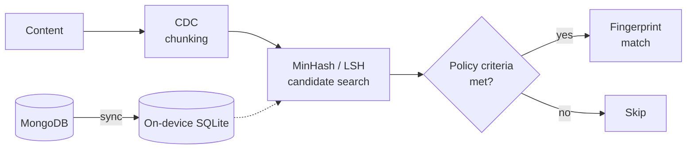
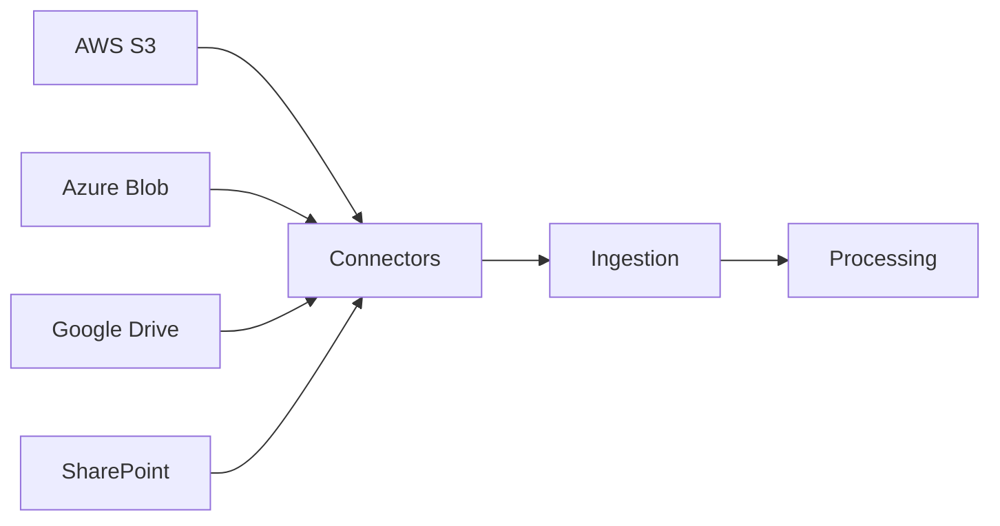

  I design <b>fault-tolerant, high-throughput backend systems</b> that stay correct under load, failure and multi-tenant pressure, 
  and ship them with real testing and CI/CD.

  
  
  
  
  
  

---

## ⚡ Impact at a Glance

<table align="center">
  <tr>
    <td align="center" width="25%"><h2>2,000+</h2><b>events / sec</b> SIEM log forwarding zero message loss</td>
    <td align="center" width="25%"><h2>10M+</h2><b>events / run</b> distributed bulk export fair across 100+ tenants</td>
    <td align="center" width="25%"><h2>100+ × 100+</h2><b>tenants × devices</b> content-aware DLP offline detection</td>
    <td align="center" width="25%"><h2>4</h2><b>cloud sources</b> S3 · Azure Blob Google Drive · SharePoint</td>
  </tr>
</table>

---

## 🧠 What I Build

### 1. SIEM Log-Forwarding Microservice
> Lock-free pipeline sustaining **2,000+ events/sec with zero message loss**

HTTP/TCP delivery in JSON and Syslog formats, built on the **LMAX Disruptor**, with per-vendor rate limits enforced on the way out.

### 2. Distributed Bulk-Export Pipeline
> Processes **10M+ security events per run** with fair scheduling across **100+ tenants**

Built with **Java, Spring Batch, AWS S3, Redis and RabbitMQ**. Per-tenant Redis token buckets and processing-time quotas, plus RabbitMQ priority queuing, remove noisy-neighbor starvation.

### 3. Content-Based Data Loss Prevention Engine
> Supports **100+ tenants with 100+ devices each**, with fully **offline** violation detection

**CDC chunking + MinHash/LSH** gives sublinear similarity search. Fingerprint matching runs only when policy criteria are met, which removes redundant computation. Signatures sync from MongoDB to on-device SQLite.

### 4. Cloud Data Discovery
> Connector architecture, ingestion and processing pipelines for **4 cloud sources**

---

## 🛠️ Tech Stack

  <b>Languages</b> 
    
  <b>Backend</b> 
    
  <b>Messaging & Data</b> 
    
  <b>Frontend</b> 
    
  <b>Cloud & DevOps</b> 
  

  <code>Distributed Systems</code> · <code>Concurrency</code> · <code>Rate Limiting</code> · <code>Message Queues & Streams</code> · <code>System Design</code> · <code>Similarity Search</code> · <code>Testing & CI/CD</code>

---

## 📊 GitHub Activity

  
  

  

---

